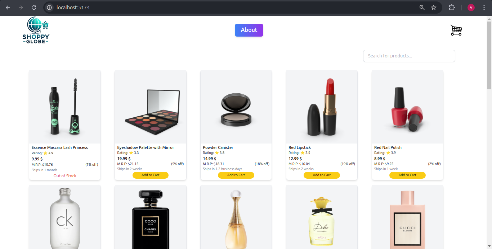

# ShoppyGlobe

Welcome to **ShoppyGlobe**, your ultimate shopping destination! This simple yet powerful e-commerce application provides a seamless shopping experience for users, offering a wide variety of products to explore and purchase.

---

## Features

- **Browse Products**: Explore our extensive catalog of items right on the homepage.
- **Product Details**: Click on any product to view its detailed description, pricing, and features.
- **Add to Cart**: Found something you like? Use the "Add to Cart" button on the product detail page to save your items for later.
- **View Your Cart**: Navigate to the cart by clicking the "Cart" button on the homepage. See all the items you've added, manage quantities (increase or decrease), and get ready to proceed with your purchase.
- **Seamless Checkout**: After finalizing your cart, proceed to the checkout page to complete your order effortlessly.

---

## Built With

- **React**: For building the dynamic and interactive user interface.
- **Vite**: To ensure fast development and optimized builds.
- **Tailwind CSS**: For a responsive and visually appealing design.

---

## Installation

Follow these steps to run ShoppyGlobe locally:

1. **Clone the Repository**:
   ```bash
   git clone https://github.com/Viraj2112/Shoppy_Globe_E-Commere_App.git
   cd ShoppyGlobe
   ```

2. **Install Dependencies**:
   ```bash
   npm install
   ```

3. **Start the Development Server**:
   ```bash
   npm run dev
   ```

4. **Open the App**:
   Visit [http://localhost:5174](http://localhost:5174) in your browser.

---

## Usage

1. Browse the homepage to explore available products.
2. Click on a product for detailed information.
3. Add desired items to your cart.
4. Manage your cart and proceed to checkout.

---

## Screenshots




---

## Contributing

Contributions are welcome! If you'd like to enhance the app or fix any issues, feel free to:

1. Fork the repository.
2. Create a new branch:
   ```bash
   git checkout -b feature-name
   ```
3. Commit your changes:
   ```bash
   git commit -m 'Add a meaningful commit message'
   ```
4. Push the branch:
   ```bash
   git push origin feature-name
   ```
5. Open a pull request.

---

## Contact

For questions or suggestions, feel free to reach out at: **virajrnagarkar21@gmail.com**

